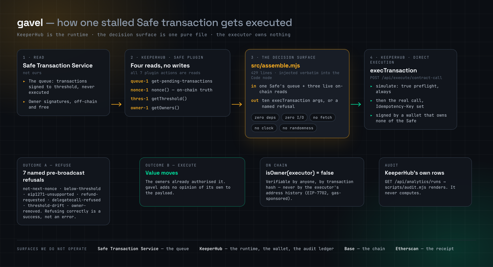

<div align="center">

  

  <h1>gavel 👨‍⚖️</h1>

  <p><em>Executes threshold-met Safe transactions from a wallet that owns nothing.</em></p>

  

  <br/>

  [](https://gavel.edycu.dev/)
  [](https://gavel.edycu.dev/deck.html)
  [](https://dorahacks.io/hackathon/agent-economy)

  <br/>

  
  
  
  
  
  
  [](https://opensource.org/licenses/MIT)
  [](https://github.com/edycutjong/gavel/actions/workflows/ci.yml)
  [](https://github.com/edycutjong/gavel/releases/latest)

</div>

---

## ⚖️ The finding this project is built on

A Safe multisig splits one act into two that are not the same thing. **Signing** is free, off-chain,
in the Safe Transaction Service. **Executing** is an on-chain call that costs gas, can be made by
**anyone**, and is nobody's job. So fully-authorised transactions rot.

The obvious next move is to scan for them. We did — read-only, over **1,299 distinct Base mainnet
Safes** sampled across 41 evenly-spaced windows covering all of Base history (blocks 2,000,000 →
50,776,046). The result killed our own pitch and replaced it with a better one:

| Naive detector: `!isExecuted && confirmations >= confirmationsRequired` | Count |
|---|---|
| Transactions matching | **366** |
| …**permanently dead** — nonce already consumed by a different tx, can never execute | **339 (92.6%)** |
| …live | 27 (7.4%) |
| …live **and** at the Safe's current nonce | 6 |
| …and simulating `SUCCESS` under `eth_call` | **2** |

> **A detector built on the obvious definition is ~93% false positives.**

And the condition itself is **rare, not epidemic**: 5 of 1,298 readable Safes (**0.39%**), or 3 of
297 (**1.01%**) among Safes that actually transact. Three of those five are threshold-1, so exactly
**one** is a genuine multi-party coordination failure. We do not claim thousands of stuck
transactions; the data we collected ourselves does not support it.

**So the guards are not defensive polish around the product. The guards *are* the product.** Anyone
can concatenate signatures. Knowing which 7.4% are real — and then which of those would actually
land — is the hard part, and it is measurable.

**Every number in that table is reproducible from this repo.** The scripts that made the calls, the
raw responses they returned, and a re-derivation that asserts all 22 published figures are committed
at [`survey/`](survey/) — and CI runs it, so the prose cannot drift away from the measurement:

```bash
python3 survey/rederive.py     # offline, no credentials, ~0.2s
```

Method in brief: Safe addresses derived from `ProxyCreation` and `ExecutionSuccess` logs on
`mainnet.base.org`; queues pulled from the Safe Transaction Service; liveness decided against
**on-chain** `nonce()` / `getThreshold()` / `getOwners()`, every confirmation `ecrecover`'d against
the *current* owner set, and every current-nonce candidate put through a read-only `execTransaction`
`eth_call`. No transaction was sent and no key was used. At n=1,298 the 95% CI on 0.39% is roughly
**0.13%–0.90%** — treat the claim as "about half a percent", and note this is a sample, not a census.

---

## 🔨 What gavel does — one sentence, one flow

> When a Safe transaction has collected enough owner signatures but nobody has paid the gas to
> execute it, gavel reassembles those signatures into the blob `checkSignatures` expects and calls
> `execTransaction` from a KeeperHub wallet that owns nothing on that Safe.

The onboarding ask is one line: *give me your Safe address.* No private key, no approval, no owner
slot, no capital, no contract to deploy. Nothing gavel can do that the owners had not already signed
for.

The decision surface is one pure file — [`src/assemble.mjs`](src/assemble.mjs), 429 lines, **zero
dependencies, zero I/O**: no fetch, no clock, no randomness, no hashing. It takes one Safe's
off-chain queue plus three live on-chain reads (`nonce()`, `getThreshold()`, `getOwners()`) and
returns either the ten `execTransaction` arguments or a **named refusal**. `fetch` *is* available in
the KeeperHub sandbox; not using it is deliberate, because a pure function can be tested offline
against real captured bytes and an impure one cannot.

---

## 🏗️ Architecture

<div align="center">
  
</div>

Four surfaces carry one transaction, and only one of them is ours. The queue and the
signatures come from the Safe Transaction Service; the liveness reads and the broadcast happen
inside KeeperHub; the chain and the receipt belong to Base and Etherscan. What gavel adds is
the middle box — a pure function that turns a queue plus three on-chain reads into either ten
`execTransaction` arguments or a refusal with a name.

---

## 🚦 The nine named outcomes

Every non-execution has a machine-readable reason. Seven are decided **pre-broadcast** by the pure
function; two are read **post-broadcast** from KeeperHub's own execution row.

| # | Outcome | Invariant | When |
|---|---|---|---|
| 1 | `not-next-nonce` | I2 · I11 | No queued tx at the live on-chain nonce — **or two different proposals share it**, which is how "replace transaction" works, and choosing between them is not gavel's call |
| 2 | `below-threshold` | I1 | Fewer distinct owner signatures than `max(queue threshold, on-chain threshold)` |
| 3 | `eip1271-unsupported` | I7 | A `CONTRACT_SIGNATURE` / `APPROVED_HASH` confirmation, or one that is not 65 well-formed bytes |
| 4 | `refund-requested` | I4 | `gasPrice != 0`, or non-zero `gasToken` / `refundReceiver` — see below, this is a drain vector aimed at the executor |
| 5 | `delegatecall-refused` | I5 | `operation == 1`. We will not `delegatecall` someone's treasury on a schedule |
| 6 | `threshold-drift` | I1 | The threshold was raised on-chain *after* signing; the queue still believes the old number is enough |
| 7 | `owner-removed` | I6 | A confirmation from an address that is no longer an owner — a signature collected legitimately last week, from an owner removed yesterday |
| 8 | `raced-gs026` | post-broadcast | Someone else consumed the nonce first. An expected outcome, not a crash |
| 9 | `inner-call-failed` | post-broadcast | `execTransaction` succeeded; the inner call reverted (`GS013`) |

Plus **two security guards that are deliberately not among the nine**, because a guard whose correct
behaviour is "never fires" must still not fall through to execution:

| Guard | Why it exists |
|---|---|
| `not-on-roster` | I3, re-checked inside the pure function and not only at the workflow's roster node, because a public Marketplace listing is a caller-open door |
| `incomplete-payload` | The Safe plugin's projection omits five of `execTransaction`'s ten arguments. When they have not been hydrated we **cannot** evaluate the refund guard — so we refuse rather than assume zero |

---

## 🏆 KeeperHub Integration

KeeperHub is not a deployment target bolted on at the end — it is the runtime. gavel has no server,
no scheduler and no wallet of its own; every read, every gate and the broadcast itself happen inside
KeeperHub. Four API surfaces and the Safe plugin carry the whole flow:

| Surface | Where | What it does here |
|---|---|---|
| **Safe plugin** (reads) | `queue-1`, `threshold-1`, `owners-1`, `nonce-1` | Pulls the off-chain queue plus the three live on-chain reads the pure function needs. All **7** Safe plugin actions are reads — there is no write action, which is exactly why `exec-1` exists |
| **`POST /api/execute/contract-call`** | [`scripts/drain.mjs`](scripts/drain.mjs) | Direct Execution. Always `simulate: true` as a preflight, then the real call with an `Idempotency-Key` so a retry can never double-broadcast |
| **`GET /api/analytics/runs`** | [`scripts/audit.mjs`](scripts/audit.mjs) | KeeperHub's own execution rows — `verified`, `receiptStatus`, `blockNumber`, `gasUsed` — are the audit ledger. We render them; we never compute them |
| **`GET /api/integrations`** | [`scripts/drain.mjs`](scripts/drain.mjs) | Resolves the executor wallet, and is where **DX-4** (unopt-outable gas sponsorship) was found |
| **`POST /api/workflows/create`** | [`scripts/sync.mjs`](scripts/sync.mjs) | Emits the `gavel-drain` graph per chain — **11 nodes** (1 trigger + 10 actions), 10 edges, committed at [`workflows/`](workflows/) |

The graph is generated, never hand-drawn: `sync.mjs` injects [`src/assemble.mjs`](src/assemble.mjs)
**verbatim** into the Code node, so the function the tests run offline and the function the canvas
runs on-chain cannot drift apart. That is the whole reason the decision surface is pure.

Seven reproducible findings came out of building against it, dated as they were hit and filed
upstream — see [`DX-REPORT.md`](DX-REPORT.md).

---
## 🕳️ The gap that would have silently disarmed a security guard

`safe/get-pending-transactions` documents its output as *"safeTxHash, to, value, data, operation,
nonce, confirmations, confirmationsRequired, dataDecoded, submissionDate"*.

`execTransaction` takes **ten** arguments. The projection supplies four of the payload fields and
omits **`safeTxGas`, `baseGas`, `gasPrice`, `gasToken`, `refundReceiver`** — verified live against
the running plugin, not read off a docs page.

Two of those five are not cosmetic. `execTransaction` pays a refund from the Safe to
`refundReceiver` and ***calls*** `gasToken`. A hostile pair is a drain vector aimed precisely at
whoever executes — which is us. The natural workaround is to default the missing fields to zero, and
**that silently disarms the single most dangerous guard in the design**: every payload then looks
refund-free, including the ones that are not.

gavel refuses with `incomplete-payload` instead, and reads the raw Transaction Service alongside the
plugin to hydrate the five fields. Filed upstream as **DX-1** in
[`DX-REPORT.md`](DX-REPORT.md) — the strongest of seven findings, with a fix that is a passthrough
rather than a redesign.

### And a normalisation we deliberately did *not* write

Every Safe integration guide tells you to normalise the signature `v` byte. gavel does not, and
[`src/assemble.mjs`](src/assemble.mjs) says why in a comment written **before** we had the data: the
Transaction Service stores each signature exactly as the signing client produced it, and Safe's own
clients already write `v = 27/28` (EIP-712) or `v = 31/32` (`eth_sign`) — precisely what
`checkSignatures` expects. Pass-through is correct; *adding* normalisation would have been the bug.

That was a prediction. Then we staged a real threshold-met payout and read the bytes back:

```
confirmations[0]  0x019db835…0c4a  ETH_SIGN  65 bytes  v = 0x1f (31)
confirmations[1]  0x20A5EdcD…D754  ETH_SIGN  65 bytes  v = 0x20 (32)
```

Predicted, then measured. The cryptographic surface stays at six lines.

---

## ✅ What is actually proven, as of 2026-09-02

**One real end-to-end execution through KeeperHub**, on Ethereum Sepolia (11155111) — the
**rehearsal** chain:

| | |
|---|---|
| tx | [`0xf0b3b611…a4cc68`](https://sepolia.etherscan.io/tx/0xf0b3b61144dc272ce39508056d600f28bbb7b92de1b2e30c4dc4da856ea4cc68) |
| executionId | `qy3vfai4lux3yokk7ilea` · `receiptStatus: success` · block 11,618,878 |
| gasUsed | **144,637** |
| value moved | **10.00 USDC** out of a Safe, to the payee |
| `isOwner(executor)` on that Safe | **false** — checked on chain |
| Safe nonce | 0 → 1 |

A threshold-met, deliberately unexecuted payout was drained by an address that owns nothing on that
Safe. Three gates ran first and all passed: `assemble.mjs` → a local read-only `eth_call` →
KeeperHub's own `simulate: true` preflight.

Also standing up today:

- **12 Safes deployed and funded** on Ethereum Sepolia from one manifest, CREATE2-deterministic —
  thresholds 1-of-2 through 3-of-5, five of them on the opt-in roster.
- **80 tests, ~0.08 s**, including [`test/live-fixture.test.mjs`](test/live-fixture.test.mjs), which
  runs the untouched `assemble.mjs` over a **committed real Safe Transaction Service response**. Unit
  fixtures prove we are self-consistent; that file proves we match reality, and they are deliberately
  two different files.
- A test that asserts **the executor is never an owner of any Safe in the cast**, because that
  non-membership *is* the product claim.
- A test that asserts **no `receiptsEligible: false` chain can contribute a row to `EVIDENCE.md`** —
  the testnet/evidence separation enforced in code, not in a habit.

### What is *not* done — stated plainly

- **No mainnet execution exists yet.** `EVIDENCE.md` is absent by design rather than empty-by-accident:
  `scripts/audit.mjs` refuses to write a row from a chain marked `receiptsEligible: false`, and the
  only executions so far are on the rehearsal chain. The rehearsal log lives separately at
  [`docs/rehearsal-11155111.md`](docs/rehearsal-11155111.md) and is labelled **NOT EVIDENCE** at the top.
- **The `gavel-drain` workflow cannot be created on our plan.** `POST /api/workflows/create` rejects
  the finished 11-node graph with `upgrade_required`: both `code/run-code` (which holds the entire
  decision surface) and `HTTP Request` (needed only *because* of the DX-1 gap above) require **pro**,
  and nothing — schemas, `get_plugin`, or 106 crawled doc pages — discloses that before create time.
  That is **DX-7**. [`scripts/drain.mjs`](scripts/drain.mjs) reaches the same on-chain outcome through
  the **Direct Execution API**, which is not plan-gated, importing the same `assemble.mjs` the tests
  run. **Same decision, same execution, different orchestration:** the workflow would decide inside
  KeeperHub; `drain.mjs` decides here and asks KeeperHub to execute. That is a weaker answer to
  "execution *through* KeeperHub" and we are not going to blur it. The generated workflow JSON is
  committed at [`workflows/`](workflows/) so the graph is inspectable either way.
- Not published to the KeeperHub Hub, not listed on the Marketplace, no demo video yet.

---

## 🧾 Why the on-chain sender looks wrong (and why the claim still holds)

Open that transaction and the top-level `From` is `0x809D8252…0444` — a relayer we do not recognise —
and `To` is a contract we do not recognise. Our `execTransaction` is an **internal call**. This will
be the first thing a judge notices, so here it is before you wonder.

KeeperHub writes on supported networks are **gas-sponsored** by default, and the docs are explicit
that *"a sponsored transaction was not sent by your wallet, so it does not appear there."* But
`eth_getCode` on our executor returns:

```
0xef0100955d84139e7621bc571b117d8eb5d28a4a222c6f
  ^^^^^^ EIP-7702 delegation designator
        └─ delegate target 0x955d8413…2c6f
```

The executor is a **delegated EOA, not a bypassed one**. Under EIP-7702 the delegate code runs *in
the EOA's own context*, so **`msg.sender` at the Safe is still the executor's address** — which is
exactly why the executor's nonce incremented (0 → 1) while its ETH balance did not change.

So the claim — *executed by an address that owns none of them* — is true, and `isOwner(executor)`
returns `false` on chain for anyone who wants to check it themselves. What is *not* true is that you
can verify it by opening the executor's address page and counting. **Verify by transaction hash.**

There is currently **no supported way to opt out of sponsorship**, which matters for any keeper whose
entire evidence is "watch this one address". Filed as **DX-4**.

---

## 🕰️ The 522-day stall (somebody else's data)

The survey turned up material we could not have staged.

**`0xE06A1ad7346Dfda7Ce9BCFba751DABFd754BAfAD`, nonce 2 — 522.6 days.** A real **2-of-3** Safe on
Base. Proposed 2025-03-28T20:24Z, fully signed to threshold **35 minutes later** by two addresses
that ecrecover to its *current* owners, and sitting at the Safe's current on-chain nonce ever since.
The execution slot has been open for a year and five months, and any address on Earth could have
called `execTransaction` on it the entire time.

And the honest part: **simulated today it reverts with `GS013`.** The signatures pass; the inner
batch fails, because the Safe's ETH balance is now 0. The authorisation is real and the opportunity
decayed — which is the sharpest possible argument *for* gavel, not against it.

That is also why [`scripts/drain.mjs`](scripts/drain.mjs) will not broadcast without a passing
read-only simulation: another Safe in the sample, `0xF262c998…6DA8`, has a **guard installed**, and its
nine fully-signed transactions all revert with `InvalidSignatures()` — rejected by policy, not by
cryptography. A tool that promises to clear those is advertising drains that can never land.

---

## 🏃 Run it yourself

Only the first command runs with **zero credentials** — and it is the one that exercises the whole
decision surface.

```bash
git clone <this repo> && cd gavel
npm install
npm test                       # 80 tests, ~0.08 s, no network, no keys
```

That suite includes `test/live-fixture.test.mjs`, which runs `src/assemble.mjs` over a committed real
Transaction Service response — so "the tests pass" is not a claim about fixtures we invented.

The rehearsal token has its own suite, and it also needs nothing installed — no `forge-std`, no
`lib/`, no submodules, because the four cheatcodes it uses are declared inline:

```bash
forge test                     # 22 tests + a fuzz run
forge coverage                 # 100% lines, statements, branches and funcs
```

CI enforces that 100%, on all four metrics, rather than reporting it.

The remaining commands touch real chains and need real credentials, kept in `~/.config/` and never in
this tree (`~/.config/gavel/seed.txt` for the cast mnemonic, `~/.config/gavel/safe-api-key`,
`~/.config/keeperhub/env`):

```bash
# read-only: balances, deploy state, roster. Spends nothing.
node scripts/seed.mjs status  --chain 11155111

# compute the 12 CREATE2 Safe addresses without deploying anything.
node scripts/seed.mjs predict --chain 11155111

# deploy / fund the cast, then propose+sign a payout to threshold and STOP.
node scripts/seed.mjs deploy  --chain 11155111
node scripts/seed.mjs fund    --chain 11155111
node scripts/seed.mjs stage   --chain 11155111 --safe HERO_A

# run the pure function against a LIVE queue + live on-chain state.
node scripts/verify-assemble.mjs --chain 11155111 --safe HERO_A

# three gates, then stop. Dry by default — --execute is the only way to broadcast.
node scripts/drain.mjs --chain 11155111 --address 0xB8709787228046C4612D969A153942e1693e6169

# regenerate the workflow JSON with assemble.mjs injected verbatim into the Code node.
node scripts/sync.mjs --chain 8453 --safe-integration <id>

# render KeeperHub's own execution rows into a log; refuses ineligible chains.
node scripts/audit.mjs --chain 11155111
```

`drain.mjs` without `--execute` stops after the three gates, always. A named refusal exits `0` —
refusing correctly is a success, not an error.

---

## 🗺️ Repo map

| Path | What it is |
|---|---|
| [`src/assemble.mjs`](src/assemble.mjs) | The entire decision surface. Pure, zero deps, zero I/O. Injected verbatim into the workflow's Code node by `sync.mjs`, so canvas and repo cannot drift |
| [`src/manifest.json`](src/manifest.json) | The 12-Safe cast + per-chain constants. `receiptsEligible` is load-bearing |
| [`src/roster.json`](src/roster.json) | The opt-in list. Derived from the manifest by `seed.mjs roster`, never hand-kept |
| [`scripts/seed.mjs`](scripts/seed.mjs) | `status` · `predict` · `deploy` · `fund` · `stage` · `roster`. Stages the conditions; **never executes** |
| [`scripts/drain.mjs`](scripts/drain.mjs) | assemble → local `eth_call` → KeeperHub `simulate` → Direct Execution |
| [`scripts/verify-assemble.mjs`](scripts/verify-assemble.mjs) | The pure function against a live queue; `--write-fixture` turns today's response into a regression test |
| [`scripts/sync.mjs`](scripts/sync.mjs) | Emits the workflow JSON per chain (Safe plugin reads on 8453, `web3/read-contract` on testnets — see DX-6) |
| [`scripts/audit.mjs`](scripts/audit.mjs) | Renders KeeperHub execution rows. Renders; never computes |
| [`scripts/bench.py`](scripts/bench.py) | Reduces those rows to p50/p95 duration and gas cost. Python 3 stdlib, no network — a reducer, never a harness: with no receipts there is no output |
| [`contracts/`](contracts/) | `MockUSDC.sol`, the testnet stand-in, and [`contracts/test/`](contracts/test/) — 22 tests at 100% coverage on every metric, dependency-free |
| [`test/`](test/) | 80 tests: unit fixtures, the live-response regression file, manifest/roster invariants, and the coverage-gap suite ([`COVERAGE.md`](test/COVERAGE.md)) |
| [`survey/`](survey/) | The 1,299-Safe measurement: collectors, 1.3 MB of raw responses, and `rederive.py`, which asserts all 22 published figures offline |
| [`DX-REPORT.md`](DX-REPORT.md) | Seven reproducible KeeperHub findings, dated as they were hit |
| [`workflows/`](workflows/) | Generated `gavel-drain` graph, 11 nodes (1 trigger + 10 actions), 10 edges |
| [`docs/rehearsal-11155111.md`](docs/rehearsal-11155111.md) | Rehearsal log. Labelled NOT EVIDENCE |

---

## 🧭 What we refused to build, and why

| Not built | Reason |
|---|---|
| Any risk score or AI opinion on the payload | The owners already decided. An opinion turns gavel into a gatekeeper, which is the opposite of the product |
| EIP-1271 contract signatures | ~60 lines of offset arithmetic for a minority case that cannot be demoed without deploying a signer contract. Refused by name: `eip1271-unsupported` |
| A dashboard | The demo runs on three surfaces we did not build: app.safe.global, the KeeperHub canvas, the block explorer |
| A database or second audit ledger | KeeperHub's execution rows already carry `verified`, `receiptStatus`, `blockNumber`, `gasUsed`. A copy is a worse copy |
| A custom contract, staking, or a bond | gavel's claim is that the executor needs no trust. A bond invents the trust relationship the design exists to delete |
| Private-mempool routing | It **does** exist on KeeperHub write actions. We turn it down: private-mempool writes are not gas-sponsored, and execution outputs carry no public/private route field, so the route could never be evidenced on a receipt |
| A Safe-plugin *write* action | It does not exist. All **7** Safe plugin actions are reads. Saying so is more useful than implying otherwise |

---

## 📄 License

MIT — see [`LICENSE`](LICENSE).
